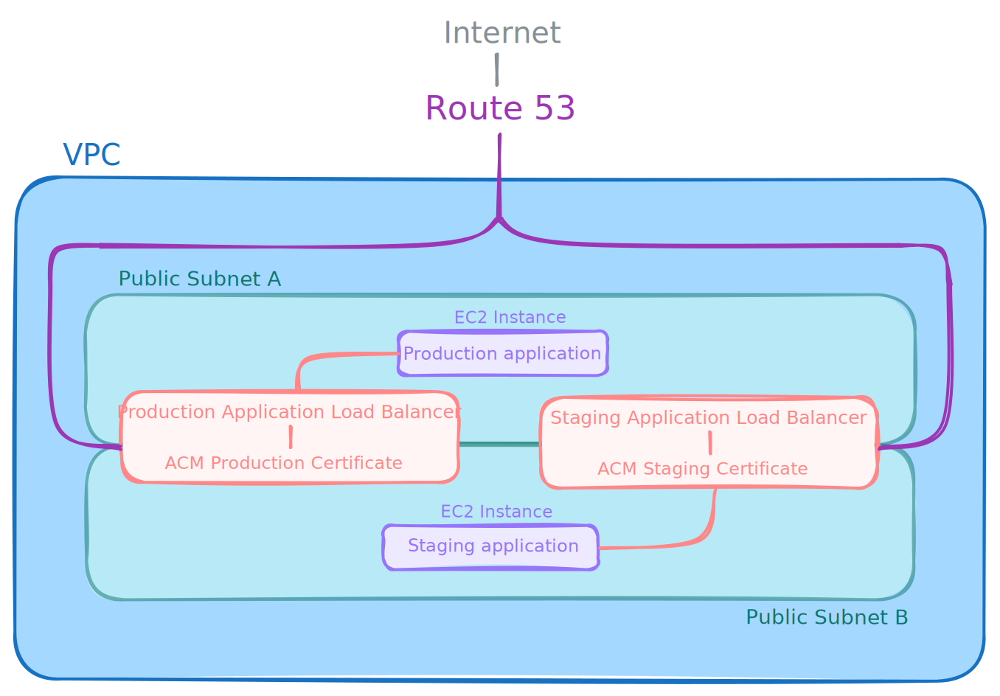
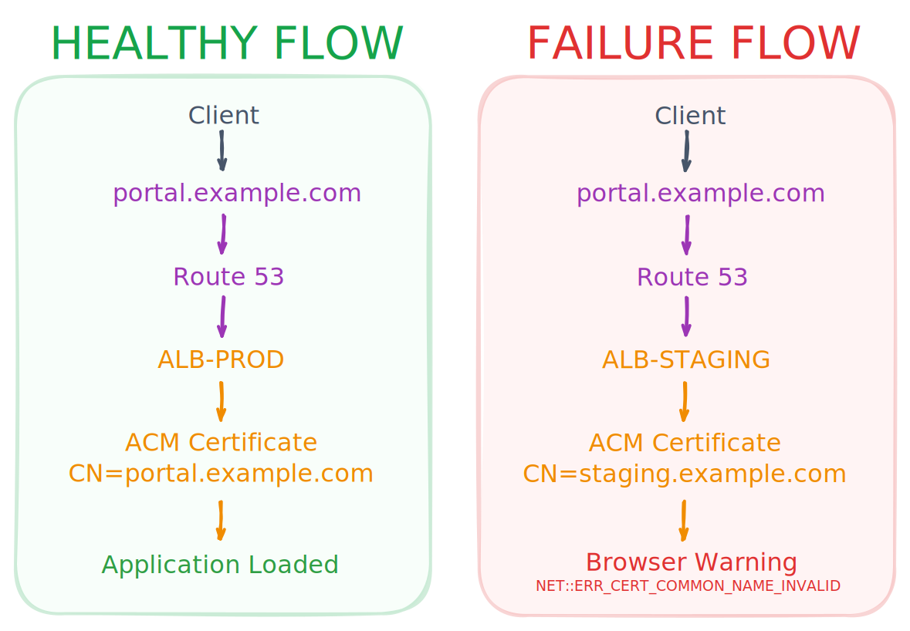

## Overview

This environment was created to simulate an HTTPS certificate error caused by incorrect DNS routing.

Users attempting to access the primary application endpoint receive SSL/TLS certificate validation errors. While the symptom initially suggests a certificate-related issue, the root cause is a DNS misconfiguration that directs traffic to the wrong Application Load Balancer.

The environment is designed to demonstrate multi-layer troubleshooting across DNS, TLS/SSL, AWS Certificate Manager (ACM), Route 53, and Application Load Balancer (ALB).

## Components

| Component | Role |
|----------|------|
| VPC | Provides network isolation for the environment |
| Public Subnets | Host the Application Load Balancers |
| Internet Gateway | Provides internet connectivity |
| Route Tables | Route traffic between subnets and the internet |
| Security Groups | Control inbound and outbound traffic |
| Route 53 Hosted Zone | Hosts DNS records for the domain |
| Route 53 Record | Resolves the application hostname |
| Production ALB | Intended HTTPS endpoint |
| Staging ALB | Alternate environment endpoint |
| ACM Certificate (Production) | Valid certificate for the production hostname |
| ACM Certificate (Staging) | Valid certificate for the staging hostname |
| Target Group | Routes traffic from the ALB to backend instances |
| EC2 Instance | Hosts the web applications |
| Web Applications | Provides the applications content |

## Operation

The application domain resolves to the production Application Load Balancer.

The production load balancer presents a TLS certificate that matches the requested hostname, allowing the HTTPS handshake to complete successfully.

## Topology

## Request Flow

## Reproduction

See [reproduction.md](./reproduction.md)